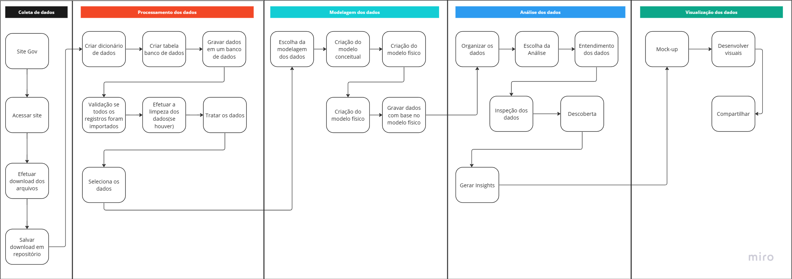
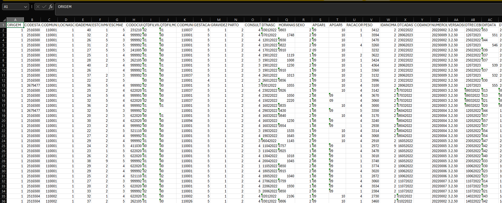
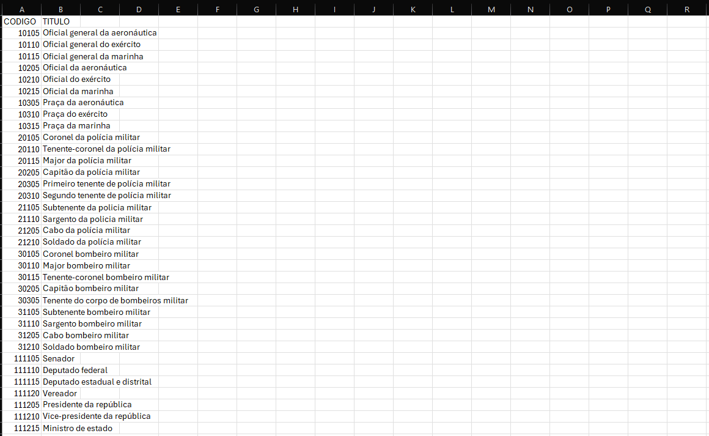
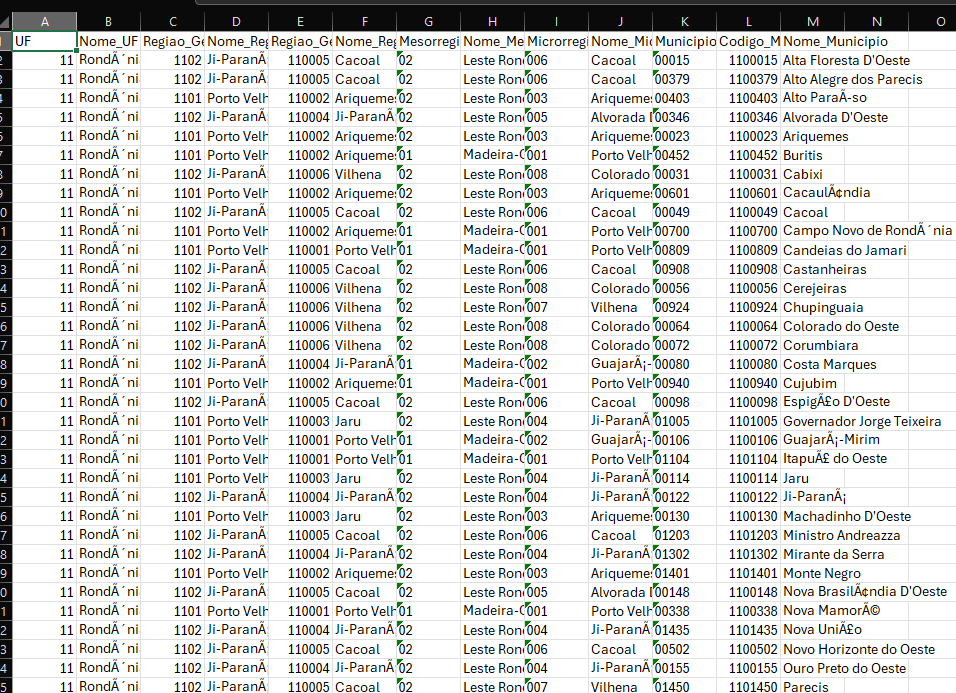
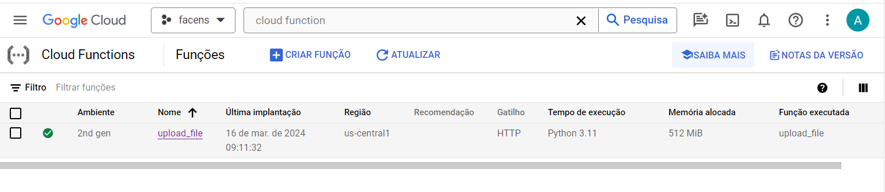
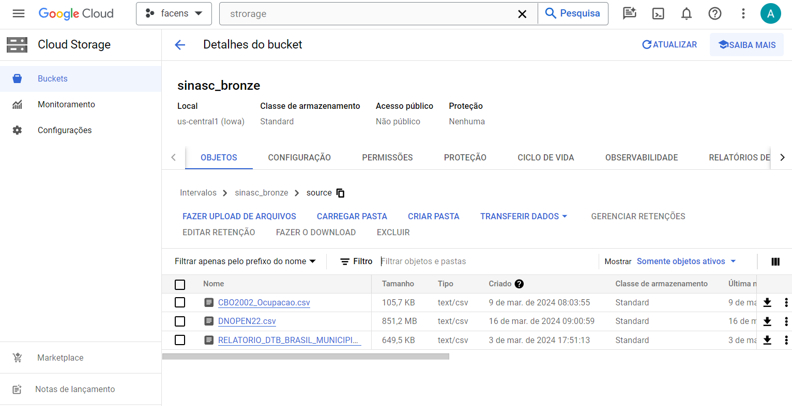

# Facens_Sinasc

O objetivo deste projeto é descrever as tecnologias para um pipeline de dados, utilizando as tecnologias em Cloud da Google e Power BI 

# Arquitetura

Para este projeto a arquitetura está definindo conforme modelo abaixo:

## Fonte de Dados

Para este projeto as fontes de dados utilizada são a base de dados do sinasc do ano de 2022, a lista de ocupações do CBO e a relação de municipio de todo território do Brasil, todas estão no formato CSV.

##### SINASC

Arquivo disponível em: https://dados.gov.br/dados/conjuntos-dados/sistema-de-informacao-sobre-nascidos-vivos-sinasc-1996-a-20201

##### CBO

Arquivo disponível em: http://www.mtecbo.gov.br/cbosite/pages/pesquisas/BuscaPorTituloA-Z.jsf

##### Municipio

Arquivo disponível em: https://www.ibge.gov.br/explica/codigos-dos-municipios.php

# Fase 1 - Ingestão do dadsos

A primeira etapa do trabalho foi carregar todos os arquivos para o bucket no Cloud Storage.

O arquivo DNOPEN22 para o download e armazenamento dele, foi criado uma Cloud Function. Com esse recurso podemos utilizar de recursos de sem um servidor, com um custo menor para atender nossa primeira demanda. Onde ela acessa via biblioteca do 
Python `requests`. Com ela podemos efetuar requisições HTTP, e por meio disso também podemos efetuar o download e gravar em Cloud Storage, servico de armazenamento da Google.

Após isso, foi efetuado o download dos dois arquivos que serão usados para enriquecimento dos dados.

Os dados ficaram armazenados conforme imagem abaixo:

# Fase 2 - Pipeline de Dados

Após a coleta de todos os arquivos, iniciaremos nosso desenvolvimento do nosso Pipilene de Dados. Para esse projeto estamos usando o Framework Apache Beam, que pode ser utilizado tanto para processamento em lote ou streaming. Neste projeto estamos usando em lote.    

## Apache Beam

Neste projeto a coleta de dados será utilizando o Apache Beam, que pode acessar nossos arquivos do Cloud Storage, para o mesmo estamos usando a biblioteca `pandas`. 

Iremos efetuar a análise com uma parcela dos dados, no arquivo original temos 61 colunas, porém aqui iremos efetuar a análise de apenas 18 colunas. Com isso depois iremos efetuar a limpeza de registros vazios.

Dado isso já iremos efetuar alguns filtros quer irá remover possíveis erros na coluna de Data Nascimento da Mãe , e também iremos remover a quantidade de filhos morto e vivo acima de 10.

Para esse projeto iremos utilizar uma parte do dataset original, a quantidade de linhas será uma amostra de 500.000 linhas, onde o arquivo original possui a quantidade 2.560.320 de linhas.

#### Base de Dados Sinasc
~~~python
  def importacao_de_dados_sinasc(file):
    columns = [
        "ESCMAEAGR1",
        "CONSULTAS",
        "SEXO",
        "PARTO",
        "GESTACAO",
        "CONTADOR",
        "ESCMAE",
        "CODOCUPMAE",
        "DTNASCMAE",
        "GESTACAO",
        "RACACORMAE",
        "ESTCIVMAE",
        "QTDFILVIVO",
        "QTDFILMORT",
        "DTNASC",
        "CODMUNNASC",
        "RACACOR",
        "LOCNASC",
    ]
    df = pd.read_csv(file, encoding='ISO-8859-1',quotechar='"',usecols=columns, delimiter=';')
    df = df.dropna()
    df['DTNASC'] = df.apply(lambda row:  datetime.strptime('0' + str(int(row['DTNASC'])), "%d%m%Y")  if len(str(int(row['DTNASC']))) < 8 else datetime.strptime(str(int(row['DTNASC'])), "%d%m%Y") , axis=1)
    df['DTNASCMAE'] = df.apply(lambda row:  datetime.strptime('0' + str(int(row['DTNASCMAE'])), "%d%m%Y")  if len(str(int(row['DTNASCMAE']))) < 8 else datetime.strptime(str(int(row['DTNASCMAE'])), "%d%m%Y") , axis=1)
    df['DTNASCMAE'] = pd.to_datetime(df['DTNASCMAE'], format='%Y-%m-%d', errors='coerce')
    df = df.loc[(df['DTNASCMAE'] >= '1950-01-01')
                     & (df['DTNASCMAE'] < '2014-01-01')]
    df = df[
        (df['QTDFILVIVO'] <= 10) & (df['QTDFILMORT'] <= 10)
    ]
    df = df.sample(n=500000)
    df['CODMUNNASC'] = df['CODMUNNASC'].apply(str)
    df['ESCMAE'] = df['ESCMAE'].apply(int)
    df['CONSULTAS'] = df['CONSULTAS'].apply(int) 
    df['SEXO'] = df['SEXO'].apply(str)
    df['PARTO'] = df['PARTO'].apply(str) 
    df['GESTACAO'] = df['GESTACAO'].apply(int) 
    df['CONTADOR'] = df['CONTADOR'].apply(int) 
    df['ESCMAE'] = df['ESCMAE'].apply(int) 
    df['CODOCUPMAE'] = df['CODOCUPMAE'].apply(int) 
    df['GESTACAO'] = df['GESTACAO'].apply(int)
    df['QTDFILVIVO'] = df['QTDFILVIVO'].apply(int)
    df['QTDFILMORT'] = df['QTDFILMORT'].apply(int)
    df['LOCNASC'] = df['LOCNASC'].apply(int)
    return df
~~~

Portanto a ingestão dos dados irá efetuar a leitura do arquivo do Sinasc e ele será base do nosso Pipeline para prosseguimento do fluxo.

#### Base de Dados Munícipio

Temos a ingestão do arquivo de munícipio, ele será usado para sabermos a região do geográfica do nosso fato. Para isso também utilizar `pandas`. 

Nele iremos utilizar a coluna com identificação do munícipio e o estado, iremos transformar do nome inteiro para uma abreviação de 2 dígitos e para o relacionamento da nossa fato temos que remover o último dígito.  

~~~python
def importacao_de_dados_municipio(file):
    df = pd.read_csv(file, delimiter=";", dtype={'Codigo_Municipio_Completo': object}) 
    df = df[['Codigo_Municipio_Completo','Nome_Municipio','Nome_UF']]
    df['Codigo_Municipio_Completo'] = df['Codigo_Municipio_Completo'].str.slice(stop=-1)
    df['UF'] = df['Nome_UF'].map(estados_dict)
    df = df[['Codigo_Municipio_Completo','Nome_Municipio','UF']]
    return df
~~~

Depois de efetuada a primeira leitura do arquivo, iremos efetuar o join do nosso dataset original, para que apenas registro que tiverem um fato esteja no nosso dataframe.
~~~python
  resultado_municipio = pd.merge(df_sinasc, df_municipio, left_on='CODMUNNASC', right_on='Codigo_Municipio_Completo', how='inner')
  resultado_municipio = resultado_municipio[['CODMUNNASC','Nome_Municipio','UF']]
~~~

#### Base de Dados Ocupações

# Fase 3 - Orquestração

# Fase 4 - Visualização
