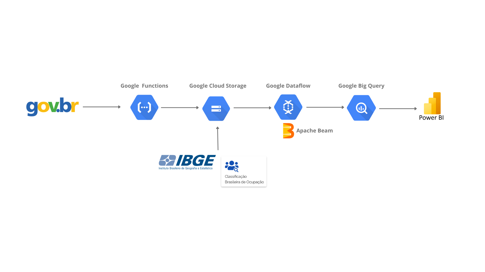

# Facens_Sinasc

O objetivo deste projeto é descrever as tecnologias para um pipeline de dados, utilizando as tecnologias em Cloud da Google e Power BI 

# Arquitetura

Para este projeto a arquitetura está definindo conforme modelo abaixo:

## Fonte de Dados

Para este projeto as fontes de dados utilizados são a base de dados do sinasc do ano de 2022, a lista de ocupações do CBO e a relação de municipio de todo território do Brasil, todas estão no formato CSV.

##### SINASC

Arquivo disponível em: https://dados.gov.br/dados/conjuntos-dados/sistema-de-informacao-sobre-nascidos-vivos-sinasc-1996-a-20201

##### CBO

Arquivo disponível em: http://www.mtecbo.gov.br/cbosite/pages/pesquisas/BuscaPorTituloA-Z.jsf

##### Municipio

Arquivo disponível em: https://www.ibge.gov.br/explica/codigos-dos-municipios.php

# Fase 1 - Ingestão do dadsos

A primeira etapa do trabalho foi carregar todos os arquivos para o bucket no Cloud Storage.

O arquivo DNOPEN22 para o download e armazenamento dele, foi criado uma Cloud Function. Com esse recurso podemos utilizar de recursos de sem um servidor, com um custo menor para atender nossa primeira demanda. Onde ela acessa via biblioteca do 
Python `requests`. Com ela podemos efetuar requisições HTTP, e por meio disso também podemos efetuar o download e gravar em Cloud Storage, servico de armazenamento da Google.

Após isso, foi efetuado o download dos dois arquivos que serão usados para enriquecimento dos dados.

Os dados ficaram armazenados conforme imagem abaixo:

# Fase 2 - Pipeline de Dados

Após a coleta de todos os arquivos, iniciaremos nosso desenvolvimento do nosso Pipilene de Dados. Para esse projeto estamos usando o Framework Apache Beam, que pode ser utilizado tanto para processamento em lote ou streaming. Neste projeto estamos usando em lote.    

## Apache Beam

Neste projeto a coleta de dados será utilizando o Apache Beam, que pode acessar nossos arquivos do Cloud Storage, para o mesmo estamos usando a biblioteca `pandas`. 

Iremos efetuar a análise com uma parcela dos dados, no arquivo original temos 61 colunas, porém aqui iremos efetuar a análise de apenas 18 colunas. Com isso depois iremos efetuar a limpeza de registros vazios.

Dado isso já iremos efetuar alguns filtros quer irá remover possíveis erros na coluna de Data Nascimento da Mãe , e também iremos remover a quantidade de filhos morto e vivo acima de 10.

Para esse projeto iremos utilizar uma parte do dataset original, a quantidade de linhas será uma amostra de 500.000 linhas, onde o arquivo original possui a quantidade 2.560.320 de linhas.

#### Base de Dados Sinasc
~~~python
  def importacao_de_dados_sinasc(file):
    columns = [
        "ESCMAEAGR1",
        "CONSULTAS",
        "SEXO",
        "PARTO",
        "GESTACAO",
        "CONTADOR",
        "ESCMAE",
        "CODOCUPMAE",
        "DTNASCMAE",
        "GESTACAO",
        "RACACORMAE",
        "ESTCIVMAE",
        "QTDFILVIVO",
        "QTDFILMORT",
        "DTNASC",
        "CODMUNNASC",
        "RACACOR",
        "LOCNASC",
    ]
    df = pd.read_csv(file, encoding='ISO-8859-1',quotechar='"',usecols=columns, delimiter=';')
    df = df.dropna()
    df['DTNASC'] = df.apply(lambda row:  datetime.strptime('0' + str(int(row['DTNASC'])), "%d%m%Y")  if len(str(int(row['DTNASC']))) < 8 else datetime.strptime(str(int(row['DTNASC'])), "%d%m%Y") , axis=1)
    df['DTNASCMAE'] = df.apply(lambda row:  datetime.strptime('0' + str(int(row['DTNASCMAE'])), "%d%m%Y")  if len(str(int(row['DTNASCMAE']))) < 8 else datetime.strptime(str(int(row['DTNASCMAE'])), "%d%m%Y") , axis=1)
    df['DTNASCMAE'] = pd.to_datetime(df['DTNASCMAE'], format='%Y-%m-%d', errors='coerce')
    df = df.loc[(df['DTNASCMAE'] >= '1950-01-01')
                     & (df['DTNASCMAE'] < '2014-01-01')]
    df = df[
        (df['QTDFILVIVO'] <= 10) & (df['QTDFILMORT'] <= 10)
    ]
    df = df.sample(n=500000)
    df['CODMUNNASC'] = df['CODMUNNASC'].apply(str)
    df['ESCMAE'] = df['ESCMAE'].apply(int)
    df['CONSULTAS'] = df['CONSULTAS'].apply(int) 
    df['SEXO'] = df['SEXO'].apply(str)
    df['PARTO'] = df['PARTO'].apply(str) 
    df['GESTACAO'] = df['GESTACAO'].apply(int) 
    df['CONTADOR'] = df['CONTADOR'].apply(int) 
    df['ESCMAE'] = df['ESCMAE'].apply(int) 
    df['CODOCUPMAE'] = df['CODOCUPMAE'].apply(int) 
    df['GESTACAO'] = df['GESTACAO'].apply(int)
    df['QTDFILVIVO'] = df['QTDFILVIVO'].apply(int)
    df['QTDFILMORT'] = df['QTDFILMORT'].apply(int)
    df['LOCNASC'] = df['LOCNASC'].apply(int)
    return df
~~~

Portanto a ingestão dos dados irá efetuar a leitura do arquivo do Sinasc e ele será base do nosso Pipeline para prosseguimento do fluxo.

#### Base de Dados Munícipio

Temos a ingestão do arquivo de munícipio, ele será usado para sabermos a região geográfica do nosso fato. Para isso também utilizar `pandas`. 

Nele iremos utilizar a coluna com identificação do munícipio e o estado. Para o relacionamento da nossa fato temos que remover o último dígito e iremos transformar nosso nome inteiro para uma abreviação de 2 dígitos. 

~~~python
def importacao_de_dados_municipio(file):
    df = pd.read_csv(file, delimiter=";", dtype={'Codigo_Municipio_Completo': object}) 
    df = df[['Codigo_Municipio_Completo','Nome_Municipio','Nome_UF']]
    df['Codigo_Municipio_Completo'] = df['Codigo_Municipio_Completo'].str.slice(stop=-1)
    df['UF'] = df['Nome_UF'].map(estados_dict)
    df = df[['Codigo_Municipio_Completo','Nome_Municipio','UF']]
    return df
~~~

Depois de efetuada a primeira leitura do arquivo, precisamos criar um relacionamento do dataset do sinasc, pois iremos criar um que tenha registros correspondentes.

~~~python
  resultado_municipio = pd.merge(df_sinasc, df_municipio, left_on='CODMUNNASC', right_on='Codigo_Municipio_Completo', how='inner')
  resultado_municipio = resultado_municipio[['CODMUNNASC','Nome_Municipio','UF']]
~~~

#### Base de Dados Ocupações

Temos também os dados das ocupações profissionais, essa dataset iremos relacionar com a mãe para saber, qual a ocupação profissional. Ele possui basicamente duas colunas que iremos trabalhar.

~~~python
def importacao_de_dados_ocupacao(file):
    df = pd.read_csv(file, delimiter=";", encoding = "ISO-8859-1" ) 
    return df
~~~ 

Logo em seguida vamos relacionar com dataset do sinasc, para criar uma relação de registros de ocupações existentes na nosssa base.

~~~python
resultado_ocupacao = pd.merge(df_sinasc, df_ocupacao, left_on='CODOCUPMAE', right_on='CODIGO', how='inner')
resultado_ocupacao = resultado_ocupacao[['CODOCUPMAE','TITULO']]
resultado_ocupacao['CODOCUPMAE'] = resultado_ocupacao['CODOCUPMAE'].astype(int)
~~~

# Fase 3 - Processamento de dados

Agora chegamos na nossa etapa de realizar nosso processamento de dados, com Apache Beam, iremos criar um fluxo para processar os dados e criar as tabelas no Big Query, criaremos ele para ser executado pelo Dataflow.

Abaixo temos nosso Modelo Entidade Relacionamento(MER):

Nesta etapa temos como objetivo replicar o modelo acima para que nosso cliente final tenha acesso, que será o Power BI. 

### Dimensões

#### `dim_profissao`
Essa dimensão tem os dados coletados de profissão do resultado ocupação. Efetuamos a limpeza dos dados, removendo qual registro duplicado, convertemos para dicionário e importamos os dados para nossa respectiva tabela.

~~~python
dim_profissao = (
    to_pcollection(resultado_ocupacao, pipeline=pipeline)
    | "Remove linhas duplicadas da dimensão profissao" >> beam.Distinct()
    | "Transformando em Dicionário Profissão" >> beam.Map(lambda line: transform_to_dict_profissao(line))
    | 'Escrevendo no BigQuery dim_profissao' >> beam.io.WriteToBigQuery(
    tabela_dim_profissao,
    write_disposition=beam.io.BigQueryDisposition.WRITE_APPEND,
    create_disposition=beam.io.BigQueryDisposition.CREATE_IF_NEEDED,
    custom_gcs_temp_location = 'gs://sinasc_bronze/tmp') 
    )
~~~ 

#### `dim_escolaridade`
Essa dimensão tem os dados coletados do sinasc. Ao iniciar ele
selecionamos a coluna referente a escolaridade, após vamos remover duplicidades, e efetuaremos o enriquecimento dos dados, para isso adicionamos a coluna descrição da escolaridade, convertemos para dicionário e importamos os dados para nossa respectiva tabela.

~~~python
dim_escolaridade = (
   sinasc
  | "Criar dataset com dados de escolaridade" >> beam.Map(lambda x: x[3])
  | "Remove duplicatas da escolaridade" >> beam.Distinct()
  | "Adicionar coluna descrição escolaridade" >> beam.Map(lambda line:adicionar_descricao_escolaridade(line))
  | "Transformando em Dicionário escolaridade" >> beam.Map(lambda line: transform_to_dict_escolaridade(line))
  | "Escrevendo no BigQuery dim_escolaridade" >> beam.io.WriteToBigQuery(
    tabela_dim_escolaridade,
    write_disposition=beam.io.BigQueryDisposition.WRITE_APPEND,
    create_disposition=beam.io.BigQueryDisposition.CREATE_IF_NEEDED,
    custom_gcs_temp_location = 'gs://sinasc_bronze/tmp')
)
~~~ 

#### `dim_gestacao`
Essa dimensão tem os dados coletados do sinasc. Ao iniciar ele
selecionamos a coluna referente a gestação, após vamos remover duplicidades, e efetuaremos o enriquecimento dos dados, para isso adicionamos a coluna descrição da semana de gestação, convertemos para dicionário e importamos os dados para nossa respectiva tabela.

~~~python
dim_gestacao = (
    sinasc
    | "Criar dataset com dados de gestação" >> beam.Map(lambda x : x[7])
    | "Remover duplicatas gestação" >> beam.Distinct()
    | "Adicionar colunas na tabela gestacao" >> beam.Map(lambda line: adicionar_gestacao(line))
    | "Transformando em Dicionário gestacao" >> beam.Map(lambda line: transform_to_dict_gestacao(line))
    | "Escrevendo no BigQuery dim_gestacao" >> beam.io.WriteToBigQuery(
    tabela_dim_gestacao,
    write_disposition=beam.io.BigQueryDisposition.WRITE_APPEND,
    create_disposition=beam.io.BigQueryDisposition.CREATE_IF_NEEDED,
    custom_gcs_temp_location = 'gs://sinasc_bronze/tmp')
)
~~~ 

#### `dim_mae`
Essa dimensão tem os dados coletados do sinasc. Ao iniciar escolhemos as colunas referente a mãe, removemos as duplicidades, e efetuaremos o enriquecimento dos dados, para isso adicionamos a coluna raça e estado civil, convertemos para dicionário e importamos os dados para nossa respectiva tabela.

~~~python
dim_mae = (
    sinasc
    | "Criar dataset com dados de mãe" >> beam.Map(lambda x : str(x[16]) + "," + str(x[3]) + "," + str(x[4]) +  "," + str(x[13]) + "," + str(x[7]) + "," + str(x[14]) + "," + str(x[2]) + "," + str(x[5]) + "," + str(x[6]))
    | "Remover duplicatas mãe" >> beam.Distinct()
    | "Adicionar colunas raca mãe e estado civil" >> beam.Map(lambda line: adicionar_colunas_raca_estado_civil(line))
    | "Transformando em Dicionário mãe" >> beam.Map(lambda line: transform_to_dict_mae(line))
    | "Escrevendo no BigQuery dim_mãe" >> beam.io.WriteToBigQuery(
     tabela_dim_mae,
     write_disposition=beam.io.BigQueryDisposition.WRITE_APPEND,
     create_disposition=beam.io.BigQueryDisposition.CREATE_IF_NEEDED,
     custom_gcs_temp_location = 'gs://sinasc_bronze/tmp')
)
~~~ 

#### `dim_consultas`
Essa dimensão tem os dados coletados do sinasc. Ao iniciar ele
selecionamos a coluna referente a consultas, após vamos remover duplicidades, e efetuaremos o enriquecimento dos dados, para isso adicionamos a coluna descrição da consulta, convertemos para dicionário e importamos os dados para nossa respectiva tabela.

~~~python
dim_consultas = (
   sinasc
  | "Criar dataset com dados de consultas" >> beam.Map(lambda x: x[9])
  | "Remove duplicatas de consultas" >> beam.Distinct()
  | "Adicionar coluna descrição consulta" >> beam.Map(lambda line:adicionar_descricao_consulta(line))
  | "Transformando em Dicionário dim_consultas" >> beam.Map(lambda line: transform_to_dict_consultas(line))
  | "Escrevendo no BigQuery dim_consultas" >> beam.io.WriteToBigQuery(
    tabela_dim_consultas,
    write_disposition=beam.io.BigQueryDisposition.WRITE_APPEND,
    create_disposition=beam.io.BigQueryDisposition.CREATE_IF_NEEDED,
    custom_gcs_temp_location = 'gs://sinasc_bronze/tmp')  
)
~~~ 

#### `dim_parto_sexo`
Essa dimensão tem os dados coletados do sinasc. Ao iniciar escolhemos as colunas referente a parto e sexo, removemos as duplicidades, e efetuaremos o enriquecimento dos dados, para isso adicionamos a coluna parto e sexo, convertemos para dicionário e importamos os dados para nossa respectiva tabela.

~~~python
dim_parto_sexo = (
   sinasc
  | "Criar dataset com dados de sexo e parto" >> beam.Map(lambda x: x[11] + ',' + x[8]  )
  | "Remove duplicatas sexo e parto" >> beam.Distinct()
  | "Adicionar colunas na tabela parto_sexo" >> beam.Map(lambda line: adicionar_parto_sexo(line))
  | 'Transformando em Dicionário parto_sexo' >> beam.Map(lambda line: transform_to_dict_parto_sexo(line))
  | 'Escrevendo no BigQuery parto e sexo' >> beam.io.WriteToBigQuery(
    tabela_dim_parto_sexo,
    write_disposition=beam.io.BigQueryDisposition.WRITE_APPEND,
    create_disposition=beam.io.BigQueryDisposition.CREATE_IF_NEEDED,
    custom_gcs_temp_location = 'gs://sinasc_bronze/tmp')  
)
~~~

#### `dim_municipio`
Essa dimensão tem os dados coletados de município do resultado município. Efetuamos a limpeza dos dados, removendo qual registro duplicado, convertemos para dicionário e importamos os dados para nossa respectiva tabela.

~~~python
dim_municipio = (
    to_pcollection(resultado_municipio, pipeline=pipeline)
    | "Remove linhas duplicadas da dimensão municipio" >> beam.Distinct()
    | "Transformando em dicionário municipio" >> beam.Map(lambda line: transform_to_dict_municipio(line))
    | "Escrevendo no BigQuery dim_municipio" >> beam.io.WriteToBigQuery(
     tabela_dim_municipio,
     write_disposition=beam.io.BigQueryDisposition.WRITE_APPEND,
     create_disposition=beam.io.BigQueryDisposition.CREATE_IF_NEEDED,
     custom_gcs_temp_location = 'gs://sinasc_bronze/tmp')    
)

~~~ 

### Fatos

#### `fato_nascidos`
Essa fato tem os dados coletados do sinasc. Ao iniciar escolhemos as colunas referente a fato, removemos as duplicidades, e efetuaremos o enriquecimento dos dados, para isso adicionamos a coluna raça e local nascimento, convertemos para dicionário e importamos os dados para nossa respectiva tabela.

~~~python
fato_nascidos = (
    sinasc 
    | "Criar dataset com dados da fato" >> beam.Map(lambda x : str(x[16]) + "," + str(x[10]) + "," + str(x[0]) + "," + str(x[8]) +  "," + str(x[11]) + "," +  str(x[9]) + "," + str(x[12]) + "," + str(x[1]))
    | "Remove duplicatas da fato" >> beam.Distinct()
    | "Enriquecimento dos dados" >> beam.Map(lambda line: adicionar_colunas_fato(line))
    | "Transformando em Dicionário Fato" >> beam.Map(lambda line: transform_to_dict_nascidos(line))
    | "Escrevendo no BigQuery fato nascidos" >> beam.io.WriteToBigQuery(
      tabela_fatos_nascidos,
      write_disposition=beam.io.BigQueryDisposition.WRITE_APPEND,
      create_disposition=beam.io.BigQueryDisposition.CREATE_IF_NEEDED,
      custom_gcs_temp_location = 'gs://sinasc_bronze/tmp')
)
~~~ 

# Fase 4 - Dataflow

Nessa fase escolhemos o Dataflow para executar nosso processamento.

Criamos um job baseado no código Apache Beam, que foi salvo no Cloud Storage, com isso podemos rodar o mesmo dentro da Cloud.

Cada etapa que definida no nosso código, agora podemos ter acesso a execução, e acesso ao gráfico abaixo da representação dos fluxos do processamento.

# Fase 5 - Visualização
